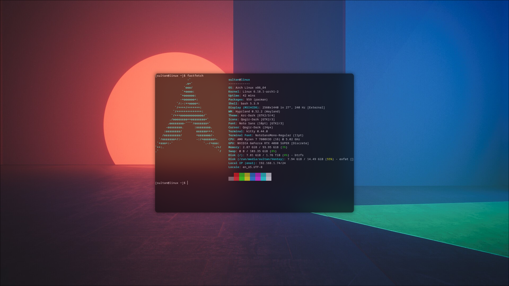

# Glass Hypr Dots



A minimal, glass-morphism themed Hyprland configuration.

## Features
- **Window Manager:** Hyprland
- **Terminal:** Kitty / Alacritty
- **Launcher:** Rofi
- **Bar:** Waybar
- **Notifications:** SwayNC
- **Style:** Glassy, transparent, dark aesthetic (Arc-Dark/Black)

## Installation

Clone the repository and run the installation script:

```bash
git clone https://github.com/compiledkernel-idk/glass-hypr-dots.git
cd glass-hypr-dots
./install.sh
```

## Structure
- `.config/hypr`: Hyprland configuration
- `.config/rofi`: Application launcher theme
- `.config/waybar`: Status bar configuration
- `.config/swaync`: Notification center configuration

## Requirements
- `hyprland`
- `rofi`
- `waybar`
- `swaync`
- `kitty` (or preferred terminal)
- `grim`, `slurp`, `wl-clipboard` (for screenshots)
